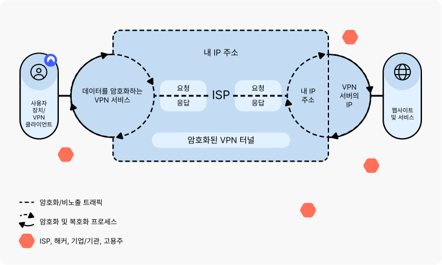

# VPN(Virtual Private Network)
가상 사설망은 사용자가 사설망에 연결된 것처럼 인터넷에 액세스할 수 있도록 하는 인터넷 보안 서비스.  
퍼블릭 네트워크를 통해 데이터를 익명으로 전송하는데 쓰이는데 사용된다.   
보통 퍼블릭 네트워크를 통해 연결할 떼 개인정보 보호를 위해 사용된다.  
접속 과정에서 IP 주소를 숨겨 익명성을 유지하기 위해 쓰인다.  
VPN은 암호화를 사용하여 무단 액세스로부터 인터넷 연결을 보호할 수도 있다.  
또한 의심스러운 인터넷 활동이 있을 경우 미리 선택된 프로그램을 끝내는 종료 메커니즘을 구현할 수도 있다.  

## VPN 작동 방식

일반적으로 대부분의 인터넷 트래픽은 암호화되지 않은 public이다.  
사용자가 브라우저에서 웹 사이트를 방문하는 것과 같이 인터넷에 연결할 때 사용자의 장치는 인터넷 서비스 공급자(Intternet Service Provider)에 연결되고 ISP는 인터넷에 연결하여 통신할 적절한 웹 서버를 찾아서 요청 웹 사이트를 가져온다.  
사용자에 대한 정보는 웹 사이트 요청의 모든 단계에서 노출된다.   
사용자의 IP 주소는 프로세스 전반에 걸쳐 노출되므로 ISP 및 기타 중개자는 사용자의 검색 습관에 대한 로그를 유지할 수 있다.   
또한 사용자의 장치와 웹 서버 간에 전송되는 데이터는 암호화되지 않는다.  
따라서 악의적인 행위자가 데이터를 염탐하거나 경로상 공격과 같은 사용자 공격을 수행할 기회가 생긴다.  
반대로, VPN 서비스를 사용하여 인터넷에 연결하는 사용자는 더 높은 수준의 보안과 개인정보 보호를 누릴 수 있니다.   
VPN 연결은 다음 4단계로 이루어진다.  

1. VPN 클라이언트(유저 장치에 설치된 VPN 소프트웨어)는 암호화된 연결을 사용해 ISP에 연결.
2. ISP는 VPN 클라이언트를 VPN 서버에 연결해 암호화된 연결 유지.
3. VPN 서버는 사용자 장치의 데이터를 해독한 다음 인터넷에 연결하여 암호화되지 않은 통신으로 웹 서버에 액세스.
4. VPN 서버는 'VPN 터널'이라고 불리는, 클라이언트와의 암호화된 연결을 생성.
5. 각 데이터 패킷이 안전하게 유지되도록 VPN은 외부 패킷에 해당 패킷을 래핑한 다음 캡슐화를 통해 암호화. 전송 중에 데이터를 안전하게 유지해주는 것이 VPN 터널의 핵심 요소.
6. 데이터가 서버에 도달하면 암호 해독 프로세스를 통해 외부 패킷이 제거.

VPN 클라이언트와 VPN 서버 사이의 VPN 터널은 ISP를 통과하지만, 모든 데이터가 암호화되기 때문에 ISP는 사용자의 활동을 확인할 수 없다.
VPN 서버의 인터넷 통신은 암호화되지 않지만, 웹 서버는 VPN 서버의 IP 주소만 기록하므로 사용자에 대한 정보는 제공되지 않는다.
VPN 연결은 데이터 패킷을 인터넷을 통해 서드 파티에 전송하기 전에 컴퓨터에서 다른 원격 서버로 리디렉션한다.  
가상 사설 네트워크는 기본적으로 로컬 컴퓨터와 수천 마일 떨어진 위치에 있는 다른 VPN 서버 사이에 보안 데이터 터널을 생성한다.  
온라인 상태가 되면 이 VPN 서버가 모든 데이터의 소스가 되어 인터넷 서비스 제공업체(ISP)와 기타 서드 파티는 더 이상 인터넷 트래픽의 콘텐츠를 볼 수 없게 된다.   
IPSec과 같은 VPN 프로토콜은 데이터 터널을 통해 데이터를 전송하기 전에 데이터를 스크램블한다.  
IPsec은 데이터 스트림의 각 IP 패킷을 인증하고 암호화함으로써 인터넷 프로토콜(IP) 통신의 보안을 유지하는 프로토콜이다.  
VPN 서비스는 필터 역할을 하여 한쪽 끝에서는 데이터를 읽을 수 없게 만들고 다른 쪽 끝에서는 디코딩만 하면 네트워크 연결이 손상되더라도 개인 데이터 오용을 방지할 수 있게 된다.  
