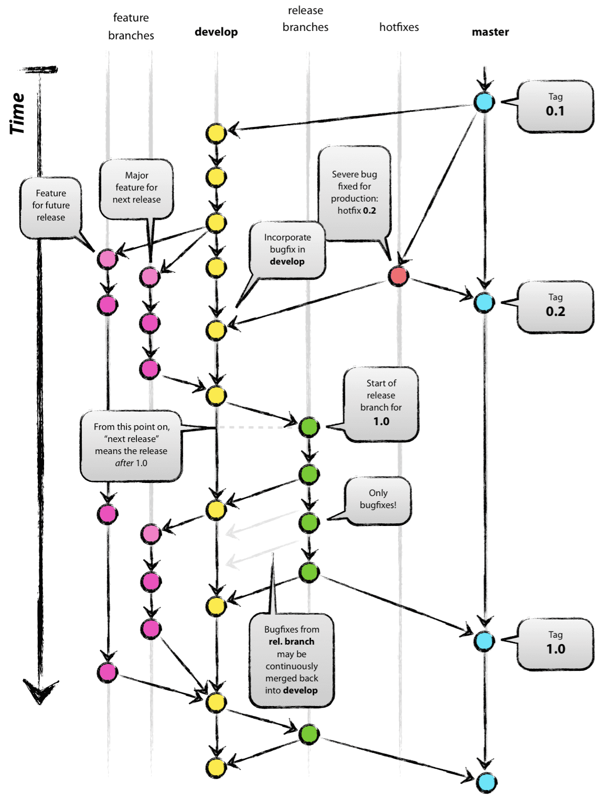

# 깃 브랜치 전략  
깃 브랜치 전략은 Git branch를 효과적으로 관리하기 위한 workflow다.  
Git Flow는 크게 Main 브랜치, Develop 브랜치, Supporting 브랜치로 구분해 관리한다.   
Main 브랜치와 ,Develop 브랜치는 개발 프로세스 전반에 걸쳐 항상 유지되는 브랜치이다.   
Supporting 브랜치는 필요에 의해 생성되고 역할을 다하면 삭제한다.   
이 Supporting 브랜치 덕분에 프로젝트의 병렬적인 업무가 가능하다.   

깃 flow
> 

## Master 브랜치
제픔으로 출시될 수 있는 브랜치   
Main 브랜치는 출시 가능한 프로덕션 코드를 모아두는 브랜치이다.   
Main 브랜치는 프로젝트 시작 시 생성되며, 개발 프로세스 전반에 걸쳐 유지된다.   
배포된 각 버전을 Tag를 이용해 표시해둔다.   

## Develop 브랜치
다음 출시 버전을 개발하는 브랜치  
다음 버전 개발을 위한 코드를 모아두는 브랜치이다. 
개발이 완료되면 Main 브랜치로 머지된다.  

## Feature 브랜치  
기능 개발하는 브랜치  
하나의 기능을 개발하기 위한 브랜치이다.   
Develop 브랜치에서 생성하며, 기능이 개발 완료되면 다시 Develop 브랜치로 머지된다.   
머지할때 주의점은 Fast-Forward로 머지하지 않고, Merge Commit을 생성하며 머지를 해주어야 한다. 
이렇게해야 히스토리가 특정 기능 단위로 묶이게 된다.  
네이밍은 `feature/branch-name`과 같은 형태로 생성한다.  

## Release 브랜치  
이번 출시 버전을 준비하는 브랜치.  
소프트웨어 배포를 준비하기 위한 브랜치이다.   
Develop 브랜치에서 생성하며, 버전 이름 등의 소소한 데이터를 수정하거나 배포전 사소한 버그를 수정하기 위해 사용된다.  
배포 준비가 완료되었다면 Main과 Develop 브랜치에 둘다 머지한다.   
이때, Main 브랜치에는 태그를 이용하여 버전을 표시한다.  
Release 브랜치를 따로 운용함으로써, 배포 업무와 관련없는 팀원들은 병렬적으로 Feature 브랜치에서 이어서 기능을 개발할 수 있게된다.  
네이밍은 `release/v1.1` 과 같은 형태로 생성한다.  

## Hotfix 브랜치
출시 버전에 발생한 버그를 수정하는 브랜치.    
이미 배포된 버전에 문제가 발생했다면, Hotfix 브랜치를 사용하여 문제를 해결한다.   
Main 브랜치에서 생성하며, 문제 해결이 완료되면 Main과 Develop 브랜치에 둘다 머지한다.  
Release 브랜치와 마찬가지로 Hotfix 브랜치를 따로 운용함으로써, 핫픽스 업무와 관련없는 팀은 병렬적으로 기능 개발을 할 수 있다.   
네이밍은 `hotfix/v1.0.1`과 같은 형태로 생성한다.  
